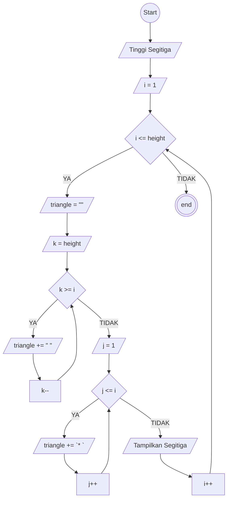

```mermaid
flowchart TB
start((Start))
input1[/Tinggi Segitiga/]
input2[/i = 1/]
check1{i <= height}
proses1[i++]
input3[/triangle = ""/]
input4[/k = height/]
check2{k >= i}
input5[/triangle += " "/]
proses2[k--]
check3{j <= i}
input6[/j = 1/]
input7[/triangle += `* `/]
proses3[j++]
output1[/Tampilkan Segitiga/]
selesai(((end)))
start --> input1
input1 --> input2
input2 --> check1
proses1 --> check1
check1 -- YA --> input3
check1 -- TIDAK --> selesai
input3 --> input4
input4 --> check2
check2 -- YA --> input5
input5 --> proses2
proses2 --> check2
check2 -- TIDAK --> input6
input6 --> check3
check3 -- YA --> input7
input7 --> proses3
proses3 --> check3
check3 -- TIDAK --> output1
output1 --> proses1
```